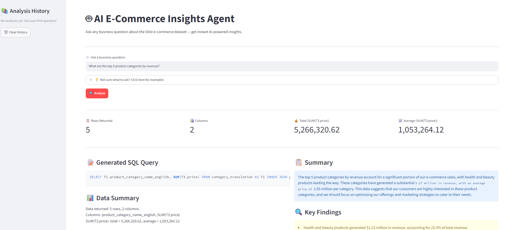
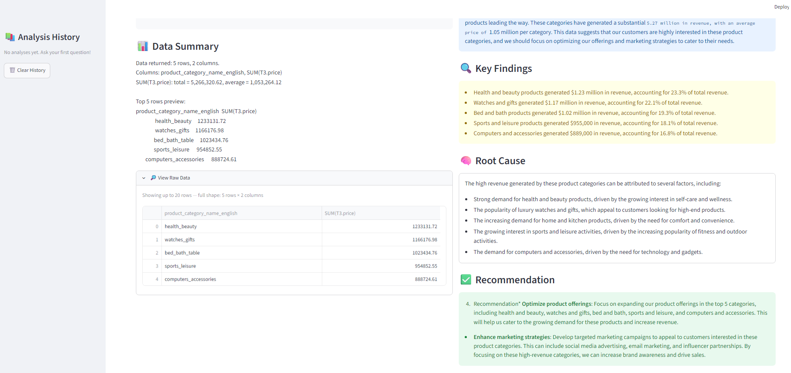
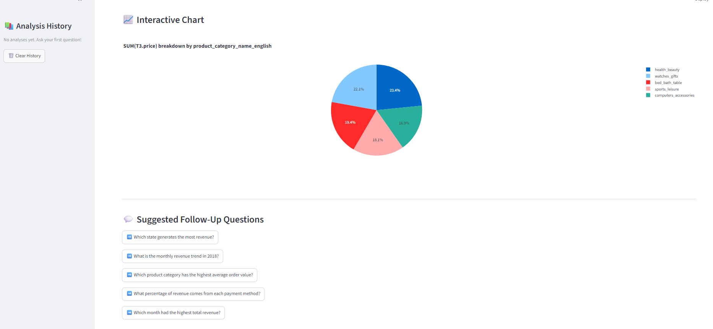

# 🤖 AI E-Commerce Insights Agent

An AI-powered business intelligence agent that transforms natural language questions into data-driven insights using SQL, Python, and LLM reasoning.

> **"Why did sales drop last month?"** — just ask, and the agent answers.

---

## 🚀 Live Demo

👉 **[Try the live app here](https://ai-bi-agent-olist-eredhtii45hjasy9rvpbby.streamlit.app)**

---

## 🎯 What It Does

Instead of manually writing SQL queries and analysing spreadsheets, stakeholders can simply type a business question in plain English and receive:

- Auto-generated SQL query
- Data pulled live from the database
- AI-written business insight (Summary → Key Findings → Root Cause → Recommendation)
- Interactive visualisation
- Suggested follow-up questions

---

## 🖥️ App Screenshots





**Example questions you can ask:**
- *"What are the top 5 product categories by revenue?"*
- *"Which state has the most customers?"*
- *"What is the most popular payment method?"*
- *"What is the monthly revenue trend in 2018?"*
- *"Which product category has the highest cancellation rate?"*

---

## 🏗️ Architecture

```
User Question (Natural Language)
        ↓
Streamlit UI (app.py)
        ↓
AI Agent (agent.py)
        ↓
┌─────────────────────────────────┐
│  LLM #1: Generate SQL           │  ← Groq (Llama 3.1)
│  SQLite: Run Query              │  ← Olist Database
│  Pandas: Analyse Results        │  ← Data Summary
│  LLM #2: Generate Insight       │  ← Groq (Llama 3.1)
└─────────────────────────────────┘
        ↓
Structured Output:
Summary · Key Findings · Root Cause · Recommendation
```

---

## 🛠️ Tech Stack

| Layer | Technology |
|---|---|
| Language | Python 3.x |
| AI / LLM | Groq API (Llama 3.1 8B) |
| Agent Framework | LangChain |
| Database | SQLite (Olist Dataset) |
| Data Analysis | Pandas |
| Visualisation | Plotly |
| UI | Streamlit |

---

## 📁 Project Structure

```
ai-bi-agent-olist/
│
├── app.py                  # Streamlit UI
├── agent.py                # AI agent pipeline
│
├── tools/
│   ├── sql_tool.py         # SQL query execution
│   └── analysis_tool.py    # Pandas data analysis
│
├── prompts/
│   └── system_prompt.txt   # LLM behaviour rules
│
├── utils/
│   └── db.py               # Database connection
│
├── database/
│   └── olist.db            # SQLite database (tracked via Git LFS)
│
├── screenshots/
│   ├── demo_overview.png
│   ├── demo_insights.png
│   └── demo_chart.png
│
├── requirements.txt
└── README.md
```

---

## 🚀 Getting Started

### 1. Clone the repository
```bash
git clone https://github.com/joyceleehy/AI-BI-Agent-Olist.git
cd AI-BI-Agent-Olist
```

### 2. Install dependencies
```bash
pip install -r requirements.txt
```

### 3. Set up your API key
Create a `.env` file in the project root:
```
GROQ_API_KEY=your_groq_api_key_here
```
Get a free API key at [console.groq.com](https://console.groq.com)

### 4. Run the app
```bash
streamlit run app.py
```

---

## 💡 Key Features

| Feature | Description |
|---|---|
| Natural Language to SQL | LLM automatically writes SQL from plain English |
| Real Data | Queries live against Olist database (100k+ orders) |
| KPI Cards | Instant at-a-glance metrics (rows, total, average) |
| Structured Insights | Summary → Key Findings → Root Cause → Recommendation |
| Smart Visualisation | Auto-selects bar, line, or pie chart based on data |
| Follow-Up Questions | Suggests relevant next questions dynamically |
| Analysis History | Sidebar tracks previous questions in the session |
| Raw Data Preview | Expandable table showing up to 20 rows |

---

## 📊 Dataset

[Olist Brazilian E-Commerce](https://www.kaggle.com/datasets/olistbr/brazilian-ecommerce) — 100k orders from 2016–2018 across Brazil.

| Table | Description |
|---|---|
| orders | Order status and timestamps |
| customers | Customer location data |
| order_items | Products and prices per order |
| payments | Payment method and value |
| products | Product details and category |
| category_translation | Portuguese → English category names |

---

## 🧠 How It Works

1. **User types a question** in plain English
2. **LLM #1 (Groq)** reads the database schema and writes a SQL query
3. **SQLite** runs the query and returns raw data
4. **Pandas** summarises the data into plain text
5. **LLM #2 (Groq)** reads the summary and writes a structured business insight
6. **Streamlit** displays everything — SQL, data, chart, and insight

The key insight: **no SQL knowledge required from the user.** The agent handles everything automatically.

---

## 🙋 About

Built by **Joyce Lee** — Data & BI Analyst in HR Analytics and Business Intelligence.

This project demonstrates:
- AI agent architecture and pipeline design
- Natural language to SQL generation
- LLM prompt engineering
- End-to-end data pipeline thinking
- Streamlit application development

📎 [LinkedIn](https://www.linkedin.com/in/joyceleehy) · 📂 [GitHub](https://github.com/joyceleehy)

---

## 📄 License

This project is open source and available under the [MIT License](LICENSE).
